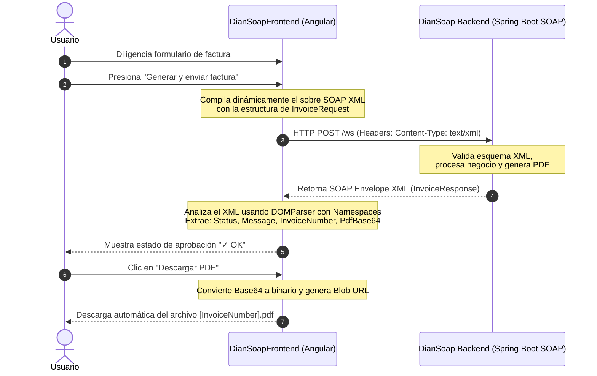

# 📑 DianSoapFrontend
## 🚀 Descripción del Proyecto

**DianSoapFrontend** es una aplicación web moderna tipo Single Page Application (SPA) construida sobre **Angular 21** y optimizada con **Vite**. Este sistema actúa como cliente de consumo para un servicio web de facturación electrónica basado en la **arquitectura SOAP**, simulando la interacción oficial con los servidores de la **DIAN (Dirección de Impuestos y Aduanas Nacionales de Colombia)**.

El sistema permite capturar la información detallada de transacciones comerciales (datos del vendedor, del cliente y detalles del producto), compilar de manera dinámica un sobre SOAP en formato XML, transmitirlo mediante peticiones HTTP estructuradas y decodificar en tiempo real la respuesta cifrada, facilitando la descarga inmediata de la factura en formato PDF.

---

## 🛠️ Arquitectura y Flujo de Comunicación

El frontend se conecta con un backend SOAP que corre localmente en el puerto `8080`. A continuación se detalla el ciclo de vida de una petición:



---

## 🌟 Características Clave

- **Formulario Inteligente y Reactivo:** Captura estructurada de datos organizada en secciones lógicas (Vendedor, Producto y Cliente) con validación nativa en tiempo real.
- **Generador de Envolturas SOAP:** Construcción automatizada de la envoltura XML `soapenv:Envelope` y el cuerpo `InvoiceRequest` requeridos por el estándar WSDL de la DIAN.
- **Procesador XML Nativo:** Parseo eficiente del XML de respuesta mediante `DOMParser` y consultas seguras por espacio de nombres (`getElementsByTagNameNS`), aislando dinámicamente los datos de respuesta (`Status`, `Message`, `InvoiceNumber`, `PdfBase64`).
- **Decodificador PDF al Vuelo:** Descarga dinámica de documentos convirtiendo cadenas `Base64` en objetos `Blob` directamente en el navegador del cliente, evitando llamadas adicionales al servidor.
- **Diseño Premium y Responsivo:** Interfaz elegante con tipografía moderna, sombras suaves, transiciones fluidas, retroalimentación visual de carga (`loading`) y estados claros de éxito o error.

---

## ⚡ Estructura del XML SOAP Utilizado

### Petición Enviada (`InvoiceRequest`)
El frontend serializa la información del formulario dentro del siguiente sobre XML enviado al endpoint `http://localhost:8080/ws`:

```xml
<soapenv:Envelope
  xmlns:soapenv="http://schemas.xmlsoap.org/soap/envelope/"
  xmlns:fac="http://dian.soap/Factura">
  <soapenv:Header/>
  <soapenv:Body>
    <fac:InvoiceRequest>
      <IdentificacionVendedor>900123456-7</IdentificacionVendedor>
      <NombreVendedor>TECNOLOGIAS DIAN S.A.S.</NombreVendedor>
      <ActividadProductiva>Desarrollo de Software</ActividadProductiva>
      <TelefonoVendedor>+57 300 123 4567</TelefonoVendedor>
      <CorreoVendedor>vendedor@empresa.com</CorreoVendedor>
      <ProductoVendido>Licencia de Servidor Cloud</ProductoVendido>
      <CodigoProducto>LIC-CLOUD-99</CodigoProducto>
      <PrecioUnitario>450000</PrecioUnitario>
      <CantidadVendida>3</CantidadVendida>
      <NombreCliente>Alisson Edwin Ltda</NombreCliente>
      <IdentificacionCliente>1012345678</IdentificacionCliente>
      <TelefonoCliente>+57 315 987 6543</TelefonoCliente>
      <CorreoCliente>cliente@empresa.com</CorreoCliente>
    </fac:InvoiceRequest>
  </soapenv:Body>
</soapenv:Envelope>
```

### Respuesta Recibida y Procesada (`InvoiceResponse`)
El backend responde con un sobre que contiene los campos mapeados:

```xml
<SOAP-ENV:Envelope xmlns:SOAP-ENV="http://schemas.xmlsoap.org/soap/envelope/">
  <SOAP-ENV:Header/>
  <SOAP-ENV:Body>
    <ns2:InvoiceResponse xmlns:ns2="http://dian.soap/Factura">
      <ns2:Status>EXITOSO</ns2:Status>
      <ns2:Message>Factura procesada y firmada digitalmente por la DIAN</ns2:Message>
      <ns2:InvoiceNumber>FACT-2026-005231</ns2:InvoiceNumber>
      <ns2:PdfBase64>[DATOS_EN_BASE64_DEL_DOCUMENTO_PDF]</ns2:PdfBase64>
    </ns2:InvoiceResponse>
  </SOAP-ENV:Body>
</SOAP-ENV:Envelope>
```

---

## 📂 Estructura del Código Fuente

A continuación se presentan los archivos clave del frontend dentro del directorio `src/app/`:

- 📄 `invoice.service.ts`: Servicio Angular que centraliza el envío de facturas. Realiza la petición HTTP POST tipo `text/xml` y procesa/parsea la respuesta XML usando `DOMParser` para transformarla en una interfaz limpia de TypeScript.
- 📄 `app.ts`: Componente principal (Controller) que gestiona el estado del formulario, la reactividad de los botones de carga y la conversión de los datos binarios Base64 para la descarga local del PDF.
- 📄 `app.html`: Vista de la aplicación estructurada semánticamente con tarjetas visuales, inputs validados y paneles dinámicos para los resultados de la DIAN.
- 📄 `app.css`: Hoja de estilos que implementa el sistema de diseño premium, rejillas responsivas (`grid`), tipografía adaptativa y variables de color consistentes.

---

## ⚙️ Requisitos Previos

Asegúrate de contar con las siguientes herramientas en tu entorno de desarrollo local:

1. **Node.js** (Versión `20.x` o superior recomendada).
2. **NPM** (Viene integrado con Node.js, versión `10.x` o superior).
3. **Servidor SOAP Activo:** El backend Spring Boot del proyecto DIANSOAP debe estar en ejecución y accesible en `http://localhost:8080/ws`.

---

## 🛠️ Guía de Instalación y Ejecución

Sigue estos sencillos pasos para levantar la aplicación localmente:

### 1. Clonar e Instalar Dependencias
Abre la consola en la raíz de este proyecto (`DianSoapFrontend`) e instala todas las dependencias requeridas ejecutando:

```bash
npm install
```

### 2. Levantar el Servidor de Desarrollo
Inicia el servidor local de desarrollo con recarga rápida automática:

```bash
npm start
```
> O alternativamente usando el CLI de Angular directamente:
> ```bash
> ng serve
> ```

Una vez iniciado, abre tu navegador favorito y accede a:
👉 **[http://localhost:4200](http://localhost:4200)**

### 3. Compilar para Producción
Para generar los artefactos optimizados y listos para distribución en producción:

```bash
npm run build
```
Los archivos optimizados se generarán en la carpeta `dist/diansoap-frontend`.

### 4. Ejecutar Pruebas Unitarias
El proyecto cuenta con un entorno moderno de testing configurado con **Vitest**. Para ejecutar las pruebas de regresión del servicio e interfaz:

```bash
npm run test
```

---

## 🔒 Control de Versiones (.gitignore)

El proyecto cuenta con un archivo `.gitignore` optimizado para entornos de Angular y NodeJS, el cual previene la carga de archivos temporales e innecesarios al repositorio remoto. Entre los elementos excluidos se encuentran:
- Directorios de dependencias pesadas (`node_modules/`).
- Carpetas de compilación y caches locales de compiladores (`dist/`, `.angular/`, `tmp/`, `out-tsc/`).
- Caches del compilador TypeScript (`*.tsbuildinfo`).
- Archivos locales y secretos del entorno (`.env`, `*.secret`).
- Configuraciones personales o temporales del editor/IDE (`.vscode/` excepto los archivos de tareas y debug recomendados, `.idea/`, `.history/`).
- Logs de depuración del administrador de paquetes (`npm-debug.log*`).
- Archivos basura del sistema operativo (`.DS_Store`, `Thumbs.db`).

---

<p align="center">
  Desarrollado para la materia de <b>Electiva II - Arquitectura de Servicios Web SOAP</b>.
</p>